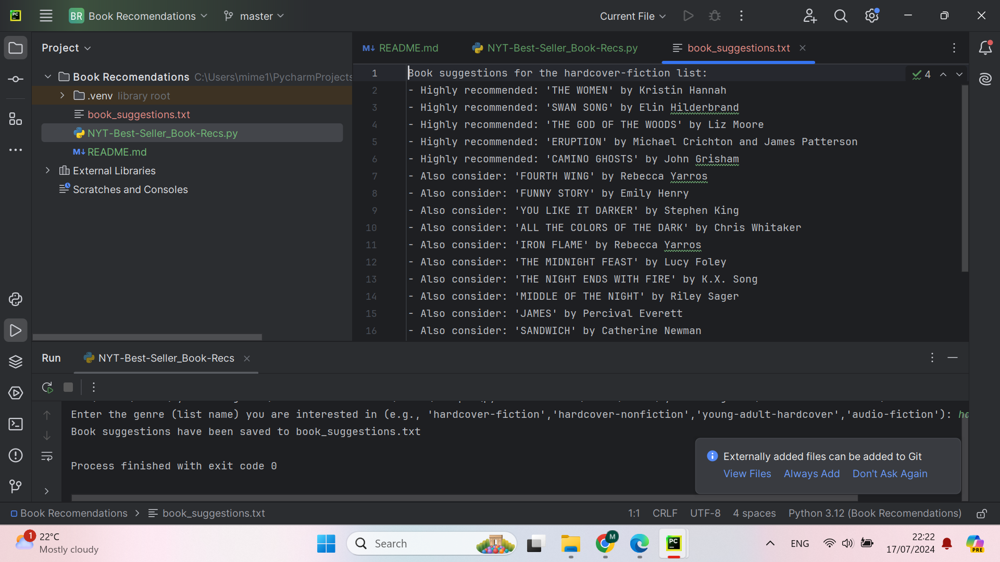

# NYT Best seller- Book Recommendations

###### As an avid reader, it was really clear for me to make a book related API. My senario is below:

_"Create a program that can retrieve multiple book recommendations based on book reviews from the New York Times-Best Seller List. The user should be able to search by genre and provide the name of the book and author in a nice readable format. The app should rank the books so the user is recommended the most popular books first. Running this program will give the user a few book recommendations for their next read."_

## 1st install 'requests' in terminal

This is necessary because the 'requests' library simplifies making HTTP requests in Python, allowing easy interaction with APIs by handling complexities and JSON parsing. It's really useful for beginners as its a straightforward syntax and comprehensive documentation, enabling cleaner and more readable code.

 pip install requests

## Explanation:

API Key Setup:

Obtain an API key from the New York Times Developer Network and replace the placeholder in the code (your_nyt_api_key_here).
Fetching Bestseller Books Data:

##### How to get your API:

Get started using the APIs in four steps:

Create an Account/Sign In.

Register apps
To register an app:

Select My Apps from the user drop-down.

Click + New App to create a new app.

Enter a name and description for the app in the New App dialog.

Click Create.

Click the APIs tab.

Click the access toggle to enable or disable access to an API product from the app.

Access the API keys

Select My Apps from th user drop-down.

Click the app in the list.

View the API key on the App Details tab.

Confirm that the status of the API key is Approved.

### Specific Assignment requirements:

The _get_bestseller_books function_ creates the API URL with the genre (list name) and API key, makes a request to the New York Times Books API, and returns the JSON response.

**Creating Suggestions:**

The create_suggestions function examines the rank of each book and generates suggestions.

**Main Function:**

The main function prompts the user for a genre (list name), fetches the bestseller books data, generates suggestions, and saves them to a file.

**Code Features:**

_Boolean Values and Branching:_
Used in create_suggestions to check the rank of the books.

_Data Structures:_
List suggestions to store book suggestions.

_Loops:_
for loop to iterate through each book and create suggestions.

_Functions:_
get_bestseller_books and create_suggestions to encapsulate functionality.

_String Slicing:_
Could be used to format strings if necessary.

_Inbuilt Functions:_
print(), open(), input(), json().

_Additional Module:_
requests module to handle API calls.

Screenshot of final result after running the function for hardcover fiction:

Created File:

